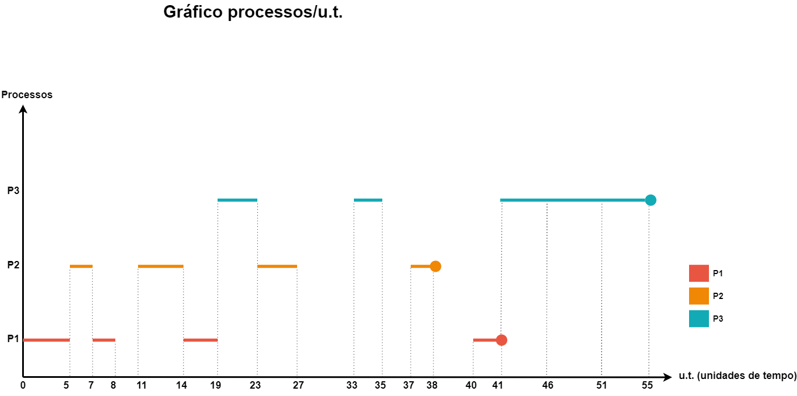

<h1 style="text-align: center;">UFRJ - INSTITUTO DE COMPUTAÇÃO</h1>

<h3 style="text-align: center;">ICP246 – Arquitetura de Computadores e Sistemas Operacionais – 2023-2</h3>

<h3 style="text-align: center;">Trabalho 2 - SIMULAÇÃO DE ESCALONAMENTO DE PROCESSOS</h3>

## Relatório - Simulação de escalonamento de processos

### Descrição

O código deste programa foi desenvolvido em C e tem como objetivo simular a execução de um escalonador utilizando a estratégia de seleção *Round Robin* com *Feedback*.

- Um breve lembrete sobre essas estratégias:
    - O escalonamento *Round Robin* é **preemptivo**, ou seja, um processo ao atingir o tempo máximo de execução (*quantum*) pré-determinado será interrompido pelo escalonador e, no caso deste simulador, será considerado um processo de baixa prioridade para a próxima eventual execução.
    - O escalonamento com *Feedback* penaliza processos que fazem alto uso da CPU, uma vez que a cada período de tempo que sofrem preempção, são adicionados à fila de baixa prioridade. Além disso, a medida que os ciclos de execução continuam, esses processos são considerados cada vez menos prioritários.

O simulador conta com 3 filas para os processos:
- alta prioridade: para processos novos e processos que retornam de I/O, somente caso seja impressora ou fita.
- baixa prioridade: para processos que sofrem preempção e processos que retornam de I/O, somente caso seja disco.
- I/O: processos que estão bloqueados, uma vez que estão executando I/O.

Cada processo irá ser representado por um *struct*, contendo, entre outros atributos auxiliares:
- PID;
- prioridade (1 ou 0; 1 sendo alta);
- status (Pronto/Bloqueado/Finalizado);

A cada ciclo de execução, o simulador irá evidenciar no *output* qual é o estado das 3 filas no intervalo dado (x u.t. -> y u.t.). Caso um processo esteja neste formato: `[-P0-]`, significa que ele já foi executado. Caso o processo esteja neste formato: `[P0]`, significa que ele está *Pronto* na fila para ser executado.

Ao final do *output* do simulador, será exibido o *turnaround* dos processos executados, isto é, o tempo total que o processo levou para ser executado desde o seu momento de ativação:
```
turnaround = tempo_de_finalizacao - tempo_de_ativacao
```

### Simulador

Para este simulador específico, foram estabelecidos alguns parâmetros. Também será utilizada uma tabela de processos específica para testar sua execução.

#### Premissas e parâmetros estipulados

- Valor da fatia de tempo (*time slice*) definido para cada processo: **5 u.t.**
- Número de processos criados: **3**
- Tempo de duração de cada tipo de I/O:

| Tipo de I/O  | Tempo de execução |
|--------------|-------------------|
| Disco        | 4 u.t.            |
| Fita         | 6 u.t.            |
| Impressora   | 10 u.t.           |


#### Tabela de processos

A tabela com os processos que serão executados no simulador:

| Processos (PID)  | Instante de ativação | Tempo de duração | Tempo de I/O | Tipo de I/O |
|------------------|----------------------|------------------|--------------|-------------|
| P1               | 0                    | 15               | 6            | Disco       |
|                  |                      |                  | 14           | Impressora  |
| P2               | 5                    | 10               | 2            | Disco       |
|                  |                      |                  | 5            | Fita        |
|                  |                      |                  | 9            | Impressora  |
| P3               | 15                   | 20               | 4            | Impressora  |
|                  |                      |                  | 6            | Fita        |

#### Output do simulador

Após a execução do simulador, este deve ser o *output* esperado:

```

>>>>>>> Inicio de novo ciclo de execucao no tempo: 0 u.t.

[Ciclo de execução: 0 u.t. -> 5 u.t.]
------------FILA DE ALTA PRIORIDADE------------
[-P1-] | P2 |
------------FILA DE BAIXA PRIORIDADE------------
P1 |
-------------------FILA DE IO-------------------


[Ciclo de execução: 5 u.t. -> 7 u.t.]
------------FILA DE ALTA PRIORIDADE------------
[-P1-] | [-P2-] |
------------FILA DE BAIXA PRIORIDADE------------
P1 |
-------------------FILA DE IO-------------------
P2 -> [Disco] - retorna no tempo 11


[Ciclo de execução: 7 u.t. -> 8 u.t.]
------------FILA DE ALTA PRIORIDADE------------
[-P1-] | [-P2-] |
------------FILA DE BAIXA PRIORIDADE------------
[-P1-] |
-------------------FILA DE IO-------------------
P2 -> [Disco] - retorna no tempo 11
P1 -> [Disco] - retorna no tempo 12


> > > [!] Nao houve execucao (CPU ociosa) no periodo: 8 u.t. -> 11 u.t.

[Ciclo de execução: 8 u.t. -> 11 u.t.]
------------FILA DE ALTA PRIORIDADE------------
[-P1-] | [-P2-] |
------------FILA DE BAIXA PRIORIDADE------------
[-P1-] | P2 |
-------------------FILA DE IO-------------------
P2 -> [Disco] - retorna no tempo 11
P1 -> [Disco] - retorna no tempo 12


[Ciclo de execução: 11 u.t. -> 14 u.t.]
------------FILA DE ALTA PRIORIDADE------------
[-P1-] | [-P2-] |
------------FILA DE BAIXA PRIORIDADE------------
[-P1-] | [-P2-] | P1 |
-------------------FILA DE IO-------------------
P2 -> [Disco] - retorna no tempo 11
P1 -> [Disco] - retorna no tempo 12
P2 -> [Fita] - retorna no tempo 20


[Ciclo de execução: 14 u.t. -> 19 u.t.]
------------FILA DE ALTA PRIORIDADE------------
[-P1-] | [-P2-] | P3 |
------------FILA DE BAIXA PRIORIDADE------------
[-P1-] | [-P2-] | [-P1-] | P1 |
-------------------FILA DE IO-------------------
P2 -> [Disco] - retorna no tempo 11
P1 -> [Disco] - retorna no tempo 12
P2 -> [Fita] - retorna no tempo 20


[Ciclo de execução: 19 u.t. -> 23 u.t.]
------------FILA DE ALTA PRIORIDADE------------
[-P1-] | [-P2-] | [-P3-] | P2 |
------------FILA DE BAIXA PRIORIDADE------------
[-P1-] | [-P2-] | [-P1-] | P1 |
-------------------FILA DE IO-------------------
P2 -> [Disco] - retorna no tempo 11
P1 -> [Disco] - retorna no tempo 12
P2 -> [Fita] - retorna no tempo 20
P3 -> [Impressora] - retorna no tempo 33


[Ciclo de execução: 23 u.t. -> 27 u.t.]
------------FILA DE ALTA PRIORIDADE------------
[-P1-] | [-P2-] | [-P3-] | [-P2-] |
------------FILA DE BAIXA PRIORIDADE------------
[-P1-] | [-P2-] | [-P1-] | P1 |
-------------------FILA DE IO-------------------
P2 -> [Disco] - retorna no tempo 11
P1 -> [Disco] - retorna no tempo 12
P2 -> [Fita] - retorna no tempo 20
P3 -> [Impressora] - retorna no tempo 33
P2 -> [Impressora] - retorna no tempo 37


[Ciclo de execução: 27 u.t. -> 30 u.t.]
------------FILA DE ALTA PRIORIDADE------------
[-P1-] | [-P2-] | [-P3-] | [-P2-] |
------------FILA DE BAIXA PRIORIDADE------------
[-P1-] | [-P2-] | [-P1-] | [-P1-] |
-------------------FILA DE IO-------------------
P2 -> [Disco] - retorna no tempo 11
P1 -> [Disco] - retorna no tempo 12
P2 -> [Fita] - retorna no tempo 20
P3 -> [Impressora] - retorna no tempo 33
P2 -> [Impressora] - retorna no tempo 37
P1 -> [Impressora] - retorna no tempo 40


> > > [!] Nao houve execucao (CPU ociosa) no periodo: 30 u.t. -> 33 u.t.

[Ciclo de execução: 30 u.t. -> 33 u.t.]
------------FILA DE ALTA PRIORIDADE------------
[-P1-] | [-P2-] | [-P3-] | [-P2-] | P3 |
------------FILA DE BAIXA PRIORIDADE------------
[-P1-] | [-P2-] | [-P1-] | [-P1-] |
-------------------FILA DE IO-------------------
P2 -> [Disco] - retorna no tempo 11
P1 -> [Disco] - retorna no tempo 12
P2 -> [Fita] - retorna no tempo 20
P3 -> [Impressora] - retorna no tempo 33
P2 -> [Impressora] - retorna no tempo 37
P1 -> [Impressora] - retorna no tempo 40


[Ciclo de execução: 33 u.t. -> 35 u.t.]
------------FILA DE ALTA PRIORIDADE------------
[-P1-] | [-P2-] | [-P3-] | [-P2-] | [-P3-] |
------------FILA DE BAIXA PRIORIDADE------------
[-P1-] | [-P2-] | [-P1-] | [-P1-] |
-------------------FILA DE IO-------------------
P2 -> [Disco] - retorna no tempo 11
P1 -> [Disco] - retorna no tempo 12
P2 -> [Fita] - retorna no tempo 20
P3 -> [Impressora] - retorna no tempo 33
P2 -> [Impressora] - retorna no tempo 37
P1 -> [Impressora] - retorna no tempo 40
P3 -> [Fita] - retorna no tempo 41


> > > [!] Nao houve execucao (CPU ociosa) no periodo: 35 u.t. -> 37 u.t.

[Ciclo de execução: 35 u.t. -> 37 u.t.]
------------FILA DE ALTA PRIORIDADE------------
[-P1-] | [-P2-] | [-P3-] | [-P2-] | [-P3-] | P2 |
------------FILA DE BAIXA PRIORIDADE------------
[-P1-] | [-P2-] | [-P1-] | [-P1-] |
-------------------FILA DE IO-------------------
P2 -> [Disco] - retorna no tempo 11
P1 -> [Disco] - retorna no tempo 12
P2 -> [Fita] - retorna no tempo 20
P3 -> [Impressora] - retorna no tempo 33
P2 -> [Impressora] - retorna no tempo 37
P1 -> [Impressora] - retorna no tempo 40
P3 -> [Fita] - retorna no tempo 41


[Ciclo de execução: 37 u.t. -> 38 u.t.]
------------FILA DE ALTA PRIORIDADE------------
[-P1-] | [-P2-] | [-P3-] | [-P2-] | [-P3-] | [-P2-] |
------------FILA DE BAIXA PRIORIDADE------------
[-P1-] | [-P2-] | [-P1-] | [-P1-] |
-------------------FILA DE IO-------------------
P2 -> [Disco] - retorna no tempo 11
P1 -> [Disco] - retorna no tempo 12
P2 -> [Fita] - retorna no tempo 20
P3 -> [Impressora] - retorna no tempo 33
P2 -> [Impressora] - retorna no tempo 37
P1 -> [Impressora] - retorna no tempo 40
P3 -> [Fita] - retorna no tempo 41


> > > [!] Nao houve execucao (CPU ociosa) no periodo: 38 u.t. -> 40 u.t.

[Ciclo de execução: 38 u.t. -> 40 u.t.]
------------FILA DE ALTA PRIORIDADE------------
[-P1-] | [-P2-] | [-P3-] | [-P2-] | [-P3-] | [-P2-] | P1 |
------------FILA DE BAIXA PRIORIDADE------------
[-P1-] | [-P2-] | [-P1-] | [-P1-] |
-------------------FILA DE IO-------------------
P2 -> [Disco] - retorna no tempo 11
P1 -> [Disco] - retorna no tempo 12
P2 -> [Fita] - retorna no tempo 20
P3 -> [Impressora] - retorna no tempo 33
P2 -> [Impressora] - retorna no tempo 37
P1 -> [Impressora] - retorna no tempo 40
P3 -> [Fita] - retorna no tempo 41


[Ciclo de execução: 40 u.t. -> 41 u.t.]
------------FILA DE ALTA PRIORIDADE------------
[-P1-] | [-P2-] | [-P3-] | [-P2-] | [-P3-] | [-P2-] | [-P1-] | P3 |
------------FILA DE BAIXA PRIORIDADE------------
[-P1-] | [-P2-] | [-P1-] | [-P1-] |
-------------------FILA DE IO-------------------
P2 -> [Disco] - retorna no tempo 11
P1 -> [Disco] - retorna no tempo 12
P2 -> [Fita] - retorna no tempo 20
P3 -> [Impressora] - retorna no tempo 33
P2 -> [Impressora] - retorna no tempo 37
P1 -> [Impressora] - retorna no tempo 40
P3 -> [Fita] - retorna no tempo 41


[Ciclo de execução: 41 u.t. -> 46 u.t.]
------------FILA DE ALTA PRIORIDADE------------
[-P1-] | [-P2-] | [-P3-] | [-P2-] | [-P3-] | [-P2-] | [-P1-] | [-P3-] |
------------FILA DE BAIXA PRIORIDADE------------
[-P1-] | [-P2-] | [-P1-] | [-P1-] | P3 |
-------------------FILA DE IO-------------------
P2 -> [Disco] - retorna no tempo 11
P1 -> [Disco] - retorna no tempo 12
P2 -> [Fita] - retorna no tempo 20
P3 -> [Impressora] - retorna no tempo 33
P2 -> [Impressora] - retorna no tempo 37
P1 -> [Impressora] - retorna no tempo 40
P3 -> [Fita] - retorna no tempo 41


[Ciclo de execução: 46 u.t. -> 51 u.t.]
------------FILA DE ALTA PRIORIDADE------------
[-P1-] | [-P2-] | [-P3-] | [-P2-] | [-P3-] | [-P2-] | [-P1-] | [-P3-] |
------------FILA DE BAIXA PRIORIDADE------------
[-P1-] | [-P2-] | [-P1-] | [-P1-] | [-P3-] | P3 |
-------------------FILA DE IO-------------------
P2 -> [Disco] - retorna no tempo 11
P1 -> [Disco] - retorna no tempo 12
P2 -> [Fita] - retorna no tempo 20
P3 -> [Impressora] - retorna no tempo 33
P2 -> [Impressora] - retorna no tempo 37
P1 -> [Impressora] - retorna no tempo 40
P3 -> [Fita] - retorna no tempo 41


[Ciclo de execução: 51 u.t. -> 55 u.t.]
------------FILA DE ALTA PRIORIDADE------------
[-P1-] | [-P2-] | [-P3-] | [-P2-] | [-P3-] | [-P2-] | [-P1-] | [-P3-] |
------------FILA DE BAIXA PRIORIDADE------------
[-P1-] | [-P2-] | [-P1-] | [-P1-] | [-P3-] | [-P3-] |
-------------------FILA DE IO-------------------
P2 -> [Disco] - retorna no tempo 11
P1 -> [Disco] - retorna no tempo 12
P2 -> [Fita] - retorna no tempo 20
P3 -> [Impressora] - retorna no tempo 33
P2 -> [Impressora] - retorna no tempo 37
P1 -> [Impressora] - retorna no tempo 40
P3 -> [Fita] - retorna no tempo 41


Todos os processos foram concluidos.
Turnaround do processo P2: 33
Turnaround do processo P1: 41
Turnaround do processo P3: 40
```

#### Gráfico desta execução



